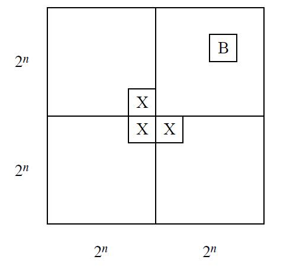

#### Problem 1

使用数学归纳法。

$k=2$时，左边为
$$
1 +\frac 1 4 =\frac 5 4
$$
右边为
$$
2-\frac 1 2 = \frac 3 2
$$
所以
$$
左边 < 右边
$$
$k=2$时结论成立。

假设$k=n$时结论成立，那么
$$
\begin{aligned}
1+\frac 1 4 +...+\frac 1 {n^2} +\frac 1 {(n+1)^2}
&<2- \frac 1 n  +\frac 1 {(n+1)^2}\\
&<2- \frac 1 n  +\frac 1 {n(n+1)}\\
&=2- \frac 1 n + \frac 1 n -\frac 1 {n+1}\\
&=2-\frac 1 {n+1}
\end{aligned}
$$
所以$k=n+1$时结论也成立。

#### Problem 2

(a)利用上图辅助证明。首先$k=0$时结论成立，假设$k=n$时结论成立，当$k=n+1$时，由对称性，只要说明Bill可以放在右上角即可，由归纳假设，右上角的$2^n \times 2^n$方块可以用L形瓷砖铺满，接下来在上图中X的位置铺一块L形瓷砖，那么由归纳假设，其余三个$2^n \times 2^n$方块可以用L形瓷砖铺满，因此$k=n+1​$时结论也成立。

(b)同样利用数学归纳法。首先$k=0$时结论成立，假设$k=n$时结论成立，当$k=n+1​$时，由对称性，只要说明Bill可以放在位于右上方矩形的中心位置，将Bill放好后，在上图中X的位置铺一块L形瓷砖，那么由(a)可知，4个缺角的方块可以用L形瓷砖铺满。

#### Problem 3

$k=0​$时，
$$
12 = 3\times 4
$$
所以$k=0$时结论成立。

假设$k=n$时结论成立，那么$k=n+1$时，分几种情形讨论。

如果$k=1$，那么
$$
1+12 = 3\times 2 + 7
$$
如果$k=2$，那么
$$
2+12 = 7\times 2
$$
如果$k\ge 3$，那么
$$
k-3 = n-2 \le n
$$
所以
$$
(k-3) + 12 = 3 a + 7b\\
a,b \in \mathbb N
$$
因此
$$
k+12 = (k-3)+12 +3 =3(a+1) + 7b
$$
因此$k=n+1$时结论也成立。

#### Problem 4

实际上没有验证$n=2$的情形，这里补充即可。

假设
$$
p| x_1 x_2
$$
如果
$$
p \nmid x_1 且p \nmid x_2
$$
因为$p$是素数，所以
$$
p\nmid x_1  x_2
$$
这就与条件矛盾，因此
$$
p| x_1 或p|x_2
$$

